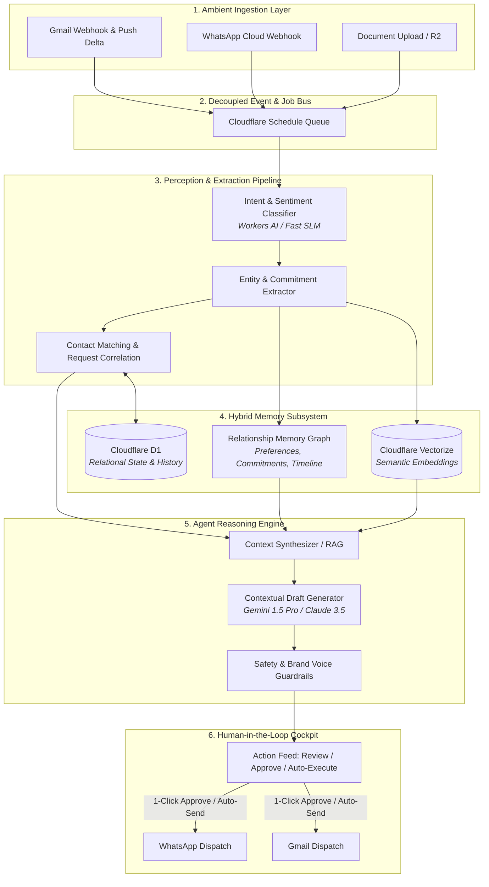

# AI-Native CRM Architecture Blueprint: Springboard V3

## Executive Vision: AI-Augmented vs. AI-Native

Traditional CRMs (Salesforce, HubSpot) and early modern tools are **passive systems of record** with AI bolted on (e.g., an LLM prompt button inside a textarea). Users must manually log notes, update stages, draft responses, and track reminders.

An **AI-Native CRM** inverts this relationship:
1. **The System is an Agent of Execution, not a Record of Storage**: The human operates as an executive approving actions, setting high-level intent, and providing feedback, while the agent handles ingestion, extraction, relationship memory, research, drafting, and follow-up loops.
2. **Ambient Ingestion & Zero-Touch Data Hygiene**: Users never update a status dropdown or log an interaction manually. Every email, WhatsApp message, calendar invite, and PDF attachment is semantically parsed to update relationship health, extract milestones, and flag commitments.
3. **Proactive, not Reactive**: Rather than waiting for a user to open a contact and remember to follow up, the engine autonomously identifies stall points, drafts high-leverage replies, detects buying/partnership signals, and cues decisions in an **Action Stream**.

---

## 1. System Architecture: The Edge Agent Loop

---

## 2. Core AI-Native Pillars

### Pillar 1: Ambient Ingestion & Semantic Memory
- **Autonomous Intent Classification**:
  - Instead of string matching on email subjects, an edge model classifies messages into canonical intents: `OBJECTION`, `PRICING_INQUIRY`, `MEETING_REQUEST`, `OUT_OF_OFFICE`, `REFERRAL`, `HARD_REJECTION`, or `CHIT_CHAT`.
- **Commitment & Obligation Extractor**:
  - Automatically identifies commitments made by either party:
    - *User commitment*: *"I'll share the vending placement deck by Thursday afternoon."* $\rightarrow$ Sets auto-task / draft prompt for Thursday morning.
    - *Contact commitment*: *"Checking with my procurement lead next Tuesday."* $\rightarrow$ Automatically sets follow-up snooze until next Wednesday.
- **Dynamic Dossier & Entity Extraction**:
  - Updates contact profile dynamically: extracted titles, pain points, preferred channels, tech stack, and personal rapport notes (e.g., *"Mentioned moving to Bangalore office"*).

### Pillar 2: Contextual Outreach & Auto-Research
- **Lead Intelligence Synthesis**:
  - When importing a contact or CSV, an agent performs lightweight domain research (extracting website focus, funding signals, product catalog) to populate the dossier.
- **Dynamic Variable Injection (Beyond `{{name}}`)**:
  - Outreach emails and WhatsApp templates adapt tone, angle, and specific value propositions based on the contact’s industry, recent company news, and exact relationship stage.
- **Objection-Handling Copilot**:
  - When an inbound reply says *"We already work with Snackit and have an exclusive lock,"* the agent surfaces verified battlecards and drafts a counter-proposition: e.g., dual-machine placement or complementary product categories.

### Pillar 3: The Action Hub (Human-in-the-Loop Cockpit)
Instead of a static table of 60 contacts where the user must click into each one, the dashboard features an **Action Stream**:
- **Confidence-Scored Actions**:
  - **Auto-pilot (High Confidence, Low Risk)**: e.g., acknowledging a document receipt, updating contact title, logging out-of-office returns.
  - **Co-pilot (Medium/High Risk)**: e.g., Pricing negotiation, contract terms, introductory pitch. The agent drafts the exact message (both WhatsApp and Email), highlights the rationale, and provides:
    - `[ 1-Click Send ]`
    - `[ Edit in Inline Diff Editor ]`
    - `[ Reject / Give Agent Feedback ]`
- **Autonomy Dials**:
  - Per-account or per-contact toggle:
    - `Level 0: Observational` (Insights only)
    - `Level 1: Draft Mode` (Drafts queued for human approval)
    - `Level 2: Autonomous Assistant` (Auto-replies within strictly bounded guidelines)

---

## 3. Technical Implementation Stack

| Layer | Recommended Technology | Rationale & Constraint Fit |
| :--- | :--- | :--- |
| **Edge Compute** | Cloudflare Workers | Existing V2 runtime. Low latency, global execution, serverless scale. |
| **Fast Inference (Triage/Classify)** | Cloudflare Workers AI (`@cf/meta/llama-3.1-8b-instruct` or `@cf/google/gemma-7b-it`) | Sub-100ms classification on Free/Standard Workers without external API latency or billing overhead. |
| **Deep Reasoning & Drafting** | Gemini 1.5 Flash / Pro (via Firebase AI or REST API) | Massive 1M+ context window (can read whole relationship history + brand docs), high fidelity, low cost per token. |
| **Relational Database** | Cloudflare D1 | Source of truth for contacts, messages, audit logs, and lease states. |
| **Vector Search / RAG** | Cloudflare Vectorize | Native Cloudflare vector database for semantic similarity across emails, documents, and historical templates. |
| **Document Storage & OCR** | Cloudflare R2 + Workers AI Document / Vision models | Parsing invoices, catalogs, and contracts sent over WhatsApp or Email. |

---

## 4. Phase-by-Phase Implementation Roadmap

### Phase 1: Smart Triage & Intent Intelligence (Zero Disruption)
- **Goal**: Make existing data actionable without altering current UI controls.
- **Deliverables**:
  1. Add an asynchronous worker queue job on every inbound email/WhatsApp to classify sentiment and intent.
  2. Upgrade `contacts` table with `ai_intent`, `sentiment_score`, and `urgency_level`.
  3. Transform the dashboard's `Attention Needed` metric to prioritize hot replies and urgent inquiries over simple recency.

### Phase 2: Autonomous Contextual Drafting
- **Goal**: Eliminate manual drafting of replies and follow-ups.
- **Deliverables**:
  1. Create a `drafts` table linking `contact_id`, `inbound_message_id`, `proposed_channel`, `content`, and `reasoning`.
  2. Implement RAG context assembly: Fetch past 10 messages + company notes + user persona prompt.
  3. Introduce the **Draft Review Modal** in the UI with a 1-click send button using existing WhatsApp/Gmail dispatches.

### Phase 3: Semantic Long-Term Memory (Vectorize Integration)
- **Goal**: Cross-conversation relationship memory.
- **Deliverables**:
  1. Set up a Cloudflare Vectorize index bound to `env.VECTOR_INDEX`.
  2. Generate embeddings for all inbound/outbound messages and document snippets using Workers AI text-embedding models (`@cf/baai/bge-base-en-v1.5`).
  3. Enable semantic search: *"Which vending operators in Bangalore asked for healthy snacks?"* or *"Who rejected us due to exclusivity?"*

### Phase 4: Proactive Agentic Follow-Ups & Autonomy Dials
- **Goal**: Full autonomous relationship maintenance.
- **Deliverables**:
  1. Autonomous cron loop that checks for stalled threads where the other party went cold.
  2. Dynamic follow-up generation that cites the specific context of their previous email rather than generic *"Just following up"* templates.
  3. Autonomy slider in Settings allowing users to whitelist contacts for auto-dispatch.

---

## 5. Security, Guardrails & Quality Invariants

1. **Brand Voice Invariant**: The agent must strictly respect configured brand tone (e.g., *Shelfwell / Aaryan* style: direct, respectful, zero corporate fluff).
2. **Deterministic Output Boundaries**: LLM generation is strictly validated against JSON schema contracts before hitting the database or UI.
3. **No Hallucinated Commitments**: The agent is forbidden from quoting pricing, discounts, or terms not explicitly registered in the user's workspace parameters.
4. **Idempotency & Replay Safety**: Autonomous actions must emit unique `idempotency_key` headers to prevent duplicate sends across retry queues.
