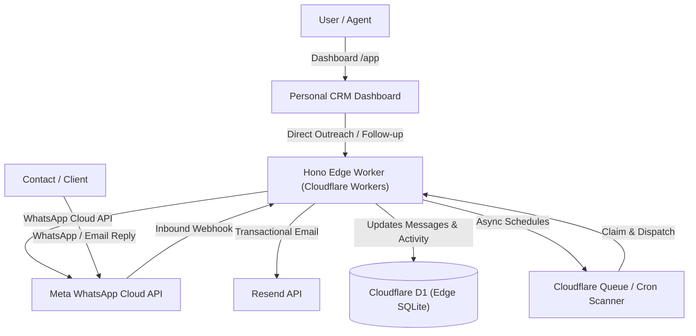

# Collectrr V2 — Personal CRM Technical Architecture & System Guide

Welcome to the Collectrr architectural and engineering guide. This document provides an exhaustive, authoritative breakdown of how Collectrr works under the hood for contributors, architects, and engineers modifying the system.

---

## 1. System Vision & Domain Model

Collectrr is a serverless, edge-deployed **Personal CRM for keeping work moving with people**. Built on Cloudflare Workers, Cloudflare D1, and Cloudflare R2, it combines direct omnichannel outreach (WhatsApp Cloud API & Email), 2-way conversation tracking, attention triage, and structured client requests.

### Core Architecture Principles
1. **Contact is Primary**: The core unit of work is the `Contact` (belonging to a `User`). A contact can have active conversations across channels, outstanding requests, scheduled follow-ups, and an activity log.
2. **Generic Requests**: Instead of vertical-specific loan/CA cases, Collectrr manages generic `requests` and `request_items` (e.g. "Send signed contract", "Upload PAN & GST", "Confirm time for Friday").
3. **Decoupled Work State vs Transport Telemetry (Split Columns)**:
   - **Action Status**: `Needs Attention` | `Needs Follow-Up` | `Waiting on Them` | `Recently Replied` | `Completed` | `Idle`
   - **Delivery Status**: `Replied` | `Read` | `Delivered` | `Sent` | `Queued` | `Failed` | `Not Contacted`
4. **Attention-Centric Triage**: The dashboard triages contacts by actionability:
   - **Needs Attention**: `waiting_on_me` request, failed outbound message, or unread inbound reply.
   - **Needs Follow-Up**: request in `needs_follow_up` state.
   - **Waiting on Them**: request in `waiting_on_them` state or outbound message sent.
   - **Recently Replied**: Inbound response received in the last 48 hours.
   - **Split Table & Workspace Presentation**: Main table and contact workspace header render dedicated `Delivery` and `Action Status` badges to eliminate ambiguity between communication delivery and workflow next steps (no legacy `New` fallbacks). The contact detail header features a dynamic contextual line (e.g. company, latest interaction, relative time, and active request) paired with the "View contact details" modal link.

---

## 2. Architecture & Tech Stack



### Component Stack
| Layer | Technology | Purpose |
|---|---|---|
| **Edge Compute** | Cloudflare Workers + Hono v4 | Ultra-low latency API routing and static asset delivery at edge points of presence worldwide. |
| **Database** | Cloudflare D1 (Edge SQLite) | ACID transactional database storing contacts, conversations, messages, requests, schedules, and credits. |
| **Blob Storage** | Cloudflare R2 | S3-compatible, zero-egress fee object storage for client documents and attachments. |
| **Messaging** | Meta WhatsApp Cloud API + Resend | Direct outreach templates, 24-hour two-way client chat, and transactional emails. |
| **Scheduling** | Cloudflare Cron + Queues | Robust asynchronous occurrence scanner, JIT credit checks, and crash-resilient dispatching. |
| **Frontend** | Vanilla JS + Modern Design System | Zero-framework-overhead, highly responsive operations dashboard and contact workspace. |

---

## 3. Directory Map & Component Responsibilities

```text
Lekho-Edge/
├── README.md                          # Repository overview & quickstart
├── PROJECT_OVERVIEW.md                # This document: architecture, flows & contracts
├── CONTRIBUTING.md                    # Contributor guide & coding standards
├── SECURITY.md                        # Vulnerability reporting & security practices
├── package.json                       # Root developer entry point
│
└── v2/                                # Active Collectrr V2 Edge Application
    ├── package.json                   # Edge worker package definition & test runner
    ├── wrangler.toml                  # Cloudflare Worker bindings
    │
    ├── migrations/                    # D1 Database Migrations
    │   ├── 0001_personal_crm_schema.sql
    │   └── 0002_campaigns_and_templates.sql
    │
    ├── src/                           # Backend Application Code
    │   ├── index.js                   # Worker entrypoint, router dispatcher & scheduled/queue handlers
    │   ├── middleware/
    │   │   ├── auth.js                # JWT session verification & role enforcement
    │   │   └── cors.js                # CORS headers & preflight handler
    │   ├── api/                       # REST API controllers
    │   │   ├── auth.js                # User authentication & registration
    │   │   ├── contacts.js            # Contact CRUD, attention filters, and workspace loader
    │   │   ├── conversations.js       # Outbound text & template dispatch controllers
    │   │   ├── requests.js            # Generic request lifecycle & checklist items
    │   │   ├── activities.js          # Activity logging and notes
    │   │   ├── schedules.js           # Schedule creation, listing, cancellation & retry
    │   │   ├── templates.js           # Full Template Manager (WhatsApp & Email template CRUD)
    │   │   ├── campaigns.js           # Campaign creation, message linking, launch, schedule, cancel, telemetry
    │   │   ├── credits.js             # Financial ledger, recharge wallet, paise math
    │   │   ├── webhook.js             # Meta WhatsApp webhook verification & event ingestion + reply attribution
    │   │   ├── session.js             # Magic link token session validation
    │   │   ├── upload.js              # Presigned R2 uploads & direct uploads
    │   │   └── admin.js               # System observability & failure analytics
    │   ├── whatsapp/                  # Protected WhatsApp Transport Layer
    │   │   ├── client.js              # Meta Graph API client & offline mock adapter
    │   │   ├── templates.js           # Template registry & parameter interpolation
    │   │   ├── pipeline.js            # Authoritative messaging pipeline with atomic locks & reservations
    │   │   ├── window.js              # 24-hour Meta service window calculation
    │   │   └── webhook.js             # Inbound payload parser & phone normalizer
    │   ├── email/                     # Outbound Email Outreach Module (Resend)
    │   │   ├── client.js              # Resend REST client with Idempotency-Key support & mock adapter
    │   │   ├── templates.js           # Responsive HTML & plain-text email renderer
    │   │   └── pipeline.js            # Authoritative email dispatch pipeline
    │   ├── scheduler/                 # Asynchronous Scheduling & Campaign Queue Engine
    │   │   ├── time.js                # Timezone conversion preserving IANA wall-clock times
    │   │   ├── scanner.js             # Cron scanner for scheduled occurrences & due scheduled campaigns
    │   │   └── consumer.js            # Queue consumer with campaign batching, direct messaging & credit isolation
    │   └── db/
    │       ├── client.js              # D1 client wrapper & compatibility driver
    │       └── schema.sql             # Canonical Personal CRM database schema
    │
    ├── public/                        # Frontend Web Applications
    │   ├── index.html                 # Marketing landing page
    │   ├── dashboard.html             # Attention triage & contacts dashboard (/dashboard or /app)
    │   ├── campaigns.html             # Outreach campaigns management, wizard, and real-time telemetry
    │   ├── templates.html             # Message template management and device simulator
    │   ├── case.html                  # Contact workspace (Conversation + Activity & Notes, Next Action recommendation card)
    │   ├── upload.html                # Client upload session portal
    │   ├── login.html, register.html, forgot-password.html # User authentication views
    │   ├── css/                       # Stylesheets (dashboard.css, case.css, tokens.css)
    │   └── js/                        # Frontend controllers (app.js, campaigns.js, templates.js, case-detail.js, login.js, register.js, forgot-password.js)
    │
    └── tests/                         # Node.js Test Suite (100% Offline Compatible)
        ├── contact-model.test.js
        ├── whatsapp-regression-gate.test.js
        ├── whatsapp-workflow.test.js
        ├── scheduling.test.js
        ├── schedule-ui.test.js
        ├── schema-parity.test.js
        ├── status-filtering.test.js
        ├── templates-ui.test.js
        ├── templates-crud.test.js
        ├── campaigns-and-templates.test.js
        ├── route-auth.test.js
        ├── credits.test.js
        ├── email-outreach.test.js
        ├── magic-link.test.js
        ├── dom-integration.test.js
        ├── frontend-syntax.test.js
        ├── case-detail-status.test.js
        └── bulk-import.test.js
```

---

## 4. Database Schema Contract (`schema.sql`)

### Core Relational Hierarchy
```text
users
  ├── contacts (UNIQUE per user_id, phone_number)
  │    ├── conversations (1 per contact per channel)
  │    │    └── messages (2-way conversation history & delivery status)
  │    ├── requests (Action items & tasks)
  │    │    └── request_items (Checklist items)
  │    ├── schedules (Automated recurring or one-off reminders)
  │    │    └── scheduled_occurrences (Claimed & processed by Cloudflare Queue)
  │    └── activities (Consolidated audit trail & internal notes)
  │
  ├── templates (Omnichannel outreach templates for WhatsApp & Email)
  │    ├── whatsapp_template_configs (Category, language, header, body, footer, buttons)
  │    └── email_template_configs (Subject, body_html, body_text)
  │
  └── campaigns (Outreach campaign definitions & state machines)
       ├── campaign_messages (Template snapshots & step orders)
       └── campaign_recipients (Immutable recipient snapshots, delivery & response telemetry)

Supporting Ledgers:
- message_templates: Legacy fallback registry
- whatsapp_messages: Meta Cloud API transport idempotency ledger
- credit_reservations: JIT credit reserve/capture state machine
- credit_transactions: Append-only balance mutations
```

### Core API Endpoints

#### Authentication & User Management
- `POST /api/auth/login`: Authenticates user.
- `POST /api/auth/register`: Creates new user account.
- `POST /api/auth/reset-password`: Updates user password hash securely.
- `GET /api/user/profile`: Returns authenticated user details and workspace info.

#### Contacts & Outreach
- `GET /api/contacts`: Returns filtered contacts list with latest message and active request summary.
- `POST /api/contacts`: Creates new contact and initializes primary WhatsApp conversation channel.
- `GET /api/contacts/:id`: Returns full contact workspace, conversation stream, and requests.
- `PATCH /api/contacts/:id`: Updates contact fields.
- `DELETE /api/contacts/:id`: Deletes contact and cascade removes associated records.

#### Message Templates
- `GET /api/templates`: Lists all system and custom templates (with WhatsApp and Email configs).
- `POST /api/templates`: Creates a new custom template (channel: `whatsapp` or `email`).
- `PUT /api/templates/:id`: Updates an existing custom template and auto-increments version.
- `DELETE /api/templates/:id`: Soft-archives a custom template (`status = 'archived'`).

#### Outreach Campaigns
- `GET /api/campaigns`: Lists user campaigns with live telemetry metrics.
- `POST /api/campaigns`: Creates a draft outreach campaign with audience filters.
- `POST /api/campaigns/preview-audience`: Previews contact count matching audience filters.
- `GET /api/campaigns/:id`: Returns full campaign details and telemetry progress.
- `GET /api/campaigns/:id/recipients`: Returns immutable recipient delivery snapshots.
- `POST /api/campaigns/:id/messages`: Configures outreach templates for the campaign.
- `POST /api/campaigns/:id/launch`: Freezes immutable recipient snapshots and triggers immediate queue dispatch.
- `POST /api/campaigns/:id/schedule`: Schedules campaign for automated scanner pickup.
- `POST /api/campaigns/:id/cancel`: Cancels pending deliveries for scheduled or running campaigns.

---

## 5. Deployment & Operational Standards

### Dual Deployment Standard
Whenever deploying changes:
1. **Deploy to Cloudflare Workers**: Run `npx wrangler deploy` inside `v2/`.
2. **Push to GitHub**: Stage changes, commit with clear semantic message, and run `git push origin main`.

### Offline Test Standard
Run all verification tests without external network dependencies:
```bash
npm --prefix v2 run test:offline
```
All 174 tests execute against local mock adapters and SQLite databases to guarantee zero external latency or API quota consumption during testing.

